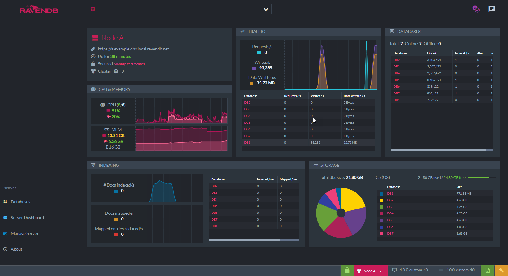

# RavenDB - An ACID NoSQL Document Database
This repository contains source code for the [RavenDB](https://ravendb.net/) document database. With a RavenDB database you can set up a NoSQL data architecture or add a NoSQL layer to your current relational database.



## Supported Platforms
- Windows
- Linux
- Docker
- MacOS
- Raspberry Pi

## Grab Your License and Download Latest Version

Request [your license](https://ravendb.net/free).

Download [the latest version of RavenDB](https://ravendb.net/downloads).

## Getting Started
Install and [set up your database](https://ravendb.net/docs/article-page/5.0/csharp/start/getting-started).

## Learn RavenDB Quickly
[RavenDB Bootcamp](https://ravendb.net/learn/bootcamp) is a free, self-directed learning course. In just three units you will learn how to use RavenDB to create fully-functional, real-world programs with NoSQL Databases. If you are unfamiliar with NoSQL, it’s okay. We will provide you with all the information you need.

## Stay Updated on New Developments
We keep adding new features to improve your RavenDB experience. Check out [our latest improvements](https://ravendb.net/docs/article-page/5.0/csharp/start/whats-new), updated weekly.

## Documentation
Access [full documentation](https://ravendb.net/docs/article-page/5.0/csharp) for RavenDB. Like our database, it is easy to use.

## Where to Ask for Help
If you have any questions, or need further assistance, you can [contact us directly](https://ravendb.net/contact).

## Report an Issue
Please check where to report an issue in our [contribution guidelines](./CONTRIBUTING.md#reporting-an-issue).

## RavenDB Developer Community Group
If you have any questions please visit our [community group](http://groups.google.com/group/ravendb/). The solutions for the most common challenges are available. You are welcome to join!

## Pull Requests
Please check how to submit a Pull Request in our [contribution guidelines](./CONTRIBUTING.md#submitting-a-pull-request).

## Setup & Run

First please [review and set up prerequisites](https://ravendb.net/docs/article-page/5.0/csharp/start/getting-started#prerequisites).

### Launch RavenDB:
Running locally:
```
<path/to/ravendb>/Server/Raven.Server
```

Registering as service in Windows using `rvn` utility available in the package *Server* directory:
```
<path\to\ravendb>\rvn.exe windows-service register --service-name RavenDB4
```

### Hello World (.NET)

#### Server Side

- Launch a RavenDB server instance as follows:
```
<path/to/ravendb>/Server/Raven.Server --ServerUrl=http://localhost:8080
```

- Open a web browser and enter `http://localhost:8080`

- Click on `Databases` in the menu on the left-hand side, and then create a new database named `SampleDataDB`

- Click on `Settings` and then on `Create Sample Data` in the left menu. Now Click on `Create`

#### Client Side

- Install .NET Core SDK. See : [Downloads](https://www.microsoft.com/net/download) and [PowerShell](https://github.com/PowerShell/PowerShell/releases)

- Open a terminal and type:

```bash
mkdir HelloWorld
cd HelloWorld
dotnet new console
```

- Add the RavenDB Client package:

```powershell
   dotnet add package RavenDB.Client --version 5.0.0-*
```

- Replace the content of Program.cs with the following:
```csharp
using System;
using Raven.Client.Documents;

namespace HelloWorld
{
    class Shippers
    {
        public string Name;
        public string Phone;
    }
    
    class Program
    {
        static void Main(string[] args)
        {
            using (var store = new DocumentStore
            {
                Urls = new string[] {"http://localhost:8080"},
                Database = "SampleDataDB"
            })
            {
                store.Initialize();

                using (var session = store.OpenSession())
                {
                    var shipper = session.Load<Shippers>("shippers/1-A");
                    Console.WriteLine("Shipper #1 : " + shipper.Name + ", Phone: " + shipper.Phone);
                }
            }
        }
    }
}
```

- Type:
```bash
dotnet restore
dotnet build
dotnet run
```

###### Enjoy :)
